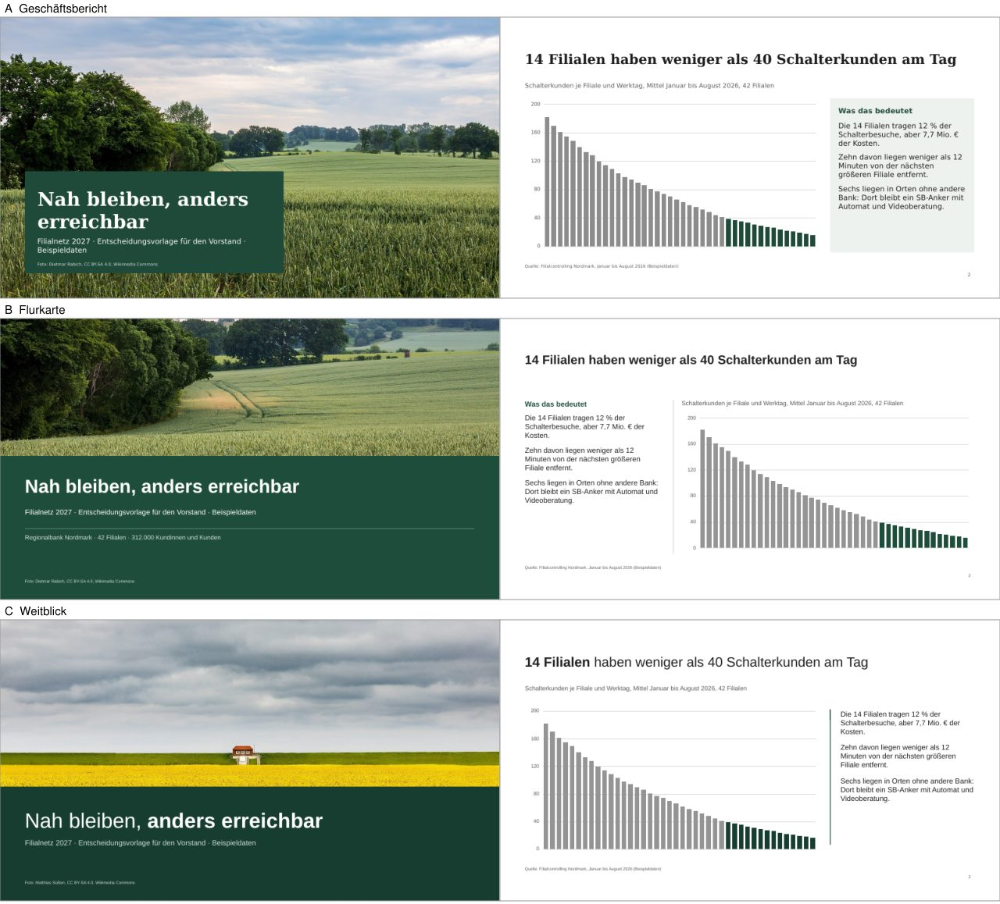
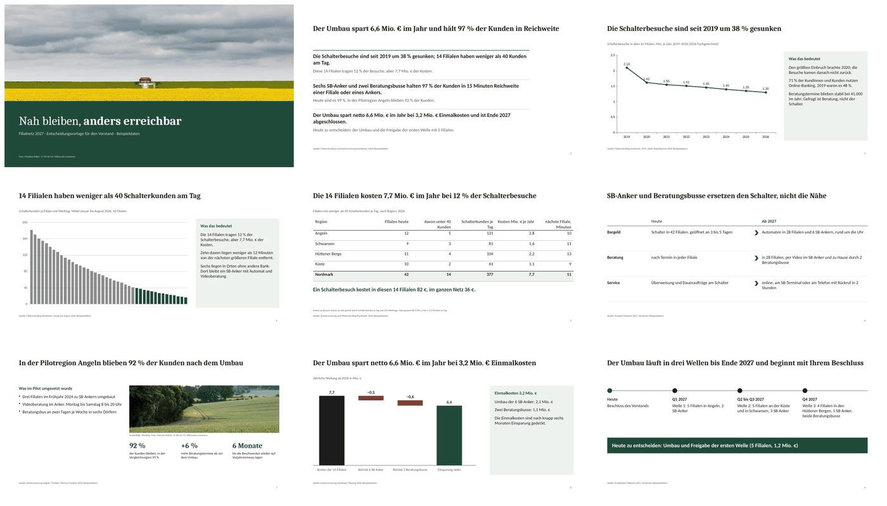
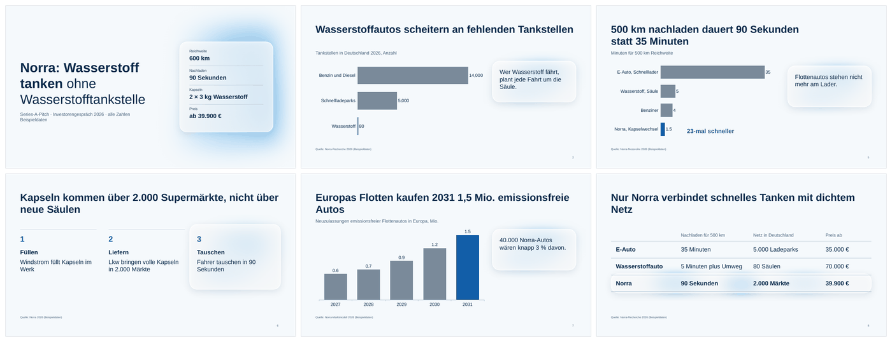

# SlideCraft

**Design rules and a quality check for presentation slides, as a Claude skill.**

SlideCraft makes Claude build slide decks the way a good consulting or keynote designer would, and keeps it away from the typical AI look: boxes inside boxes, grids of equal cards, icon tiles, rows of big numbers. It asks what the deck is for, shows the look as rendered draft slides before building, builds from 14 slide patterns taken from real consulting decks, and checks the finished file with a script.

SlideCraft decides *how slides look and argue*. The file itself is built by whatever tool is at hand (the pptx skill, the PowerPoint add-in). Where the two disagree on design, SlideCraft wins.


*Step 4: the same story in three looks, each rendered from the real slide titles and numbers. The user picks or mixes, then the deck is built.*


*A finished `read` deck (decision paper for a board), 9 slides, 0 fails in the check script.*


*A `pitch` deck with a style pinned by the user ("Apple-like, light blue, rounded, Liquid Glass"). The glass shadows are released in the deck plan; everything else is still checked.*

The example decks are fictional and in German; all numbers are sample data. Landscape photos: Wikimedia Commons, CC BY-SA 4.0, credited on the slides.

## What it does

- **Asks before it builds.** One round of questions (purpose, situation, the effect the deck should have, references, limits), then one message with the story skeleton and two or three rendered drafts. There is no default look.
- **Fits the deck to its use.** Four profiles with their own limits: `read` (read without a speaker, like a consulting deck), `talk` (keynote), `pitch`, `update`.
- **Builds stories, not slides.** Every title is a full-sentence claim; the titles alone carry the argument.
- **Uses proven layouts.** 14 patterns (chart with interpretation, focus chart, table, waterfall, before/after, timeline, key numbers, statement …), each with zones on a 12-column grid and a word budget, derived from nine public McKinsey, BCG, Bain and Roland Berger decks.
- **Writes a deck plan first.** One design system (fonts, text roles with sizes, palette with computed contrast, grid) and a slide table, before the first slide exists. The finished deck is checked against it.
- **Checks the file, not an impression.** A script reads the .pptx and reports pass or fail only for what it can measure: font sizes, contrast (WCAG), words per slide, margins, sources on data slides, alt text, deviations from the plan, banned effects (gradients, shadows, 3D, emoji icons) and 18 detector rules for AI patterns. Everything else is reported as an observation.
- **Respects what you pin.** A brand font, a template or a style you ask for beats the skill's defaults and is recorded as a waiver in the plan.
- **Improves existing decks.** Modes `audit`, `critique`, `polish`, `distill`, `typeset`, `layout`, `clarify`, `bolder`, `quieter`.

## Install

The repository is private. Everyone who installs SlideCraft from GitHub needs read access to it; otherwise send them the ZIP from the [latest release](https://github.com/Mhahx/SlideCraft/releases).

| Where | How | Status |
|---|---|---|
| **Claude Code** | `claude plugin marketplace add Mhahx/SlideCraft`, then `claude plugin install slide-craft@slidecraft`. Invoke as `/slide-craft:slide-craft` or just ask for slides | tested |
| **Claude Code on this repository** | nothing to install: the skill loads from `.claude/skills/slide-craft`. Invoke as `/slide-craft` | tested in the CLI |
| **Claude apps** (claude.ai, desktop) | Turn on code execution in the settings. Then Customize > Skills > Upload a skill and choose `slide-craft.zip`. Or Customize > Plugins > Add marketplace with `https://github.com/Mhahx/SlideCraft` | supported by Anthropic; not yet tested here |
| **Claude for PowerPoint** | skills enabled in your Claude settings are available in the add-in; call them with `/` | supported by Anthropic; whether the add-in runs the check script is untested |
| **Claude Design** | not supported (it uses design systems, not custom skills) | – |

The skill loads by itself when you ask for slides. Updates arrive through the marketplace when the version in `plugin/.claude-plugin/plugin.json` goes up; a ZIP install has to be replaced by hand.

### Requirements

- Code execution (Python 3; the check script uses the standard library only).
- For rendered drafts and the render check: LibreOffice with Impress, poppler (`pdftotext`, `pdffonts`, `pdftoppm`) and metric-compatible fonts (Debian/Ubuntu: `fonts-crosextra-carlito fonts-crosextra-caladea fonts-liberation`). Without them the skill still works, but says that overflow is estimated and shows the directions as descriptions.
- A tool that writes the file: the pptx skill in Claude apps and Claude Code, or the PowerPoint add-in.

## Use

Ask in plain words, in any language:

> Make me 10 slides for the board on why we should close 14 branches.

> Build an investor pitch for a hydrogen car. Modern, light blue and white, invent sample numbers.

> Check the design of deck.pptx and polish it.

What happens next:

1. Claude asks one round of questions about purpose, audience, situation and look.
2. You get the story (all slide titles) and two or three rendered drafts in one message. Pick one, mix, or say "you decide".
3. Claude writes the deck plan, builds the deck, runs the check script, reviews every rendered slide and fixes what it finds.
4. You get the deck, the check result and the plan as built.

The check script can also be run on its own:

```
S=plugin/skills/slide-craft/scripts
python3 $S/check_deck.py deck.pptx --profile read            # read | talk | pitch | update
python3 $S/check_deck.py deck.pptx --plan deck-plan.md --render-dir render/ --out check.json
python3 $S/check_deck.py deck.pptx --profile read --derive-plan   # write a plan from an existing deck
```

Exit code 1 means at least one fail. Details: [docs/how-it-works.md](docs/how-it-works.md).

## Status and limits

Version **0.20** (draft). What is tested:

- Two full runs with a human user (a `read` decision paper, a `pitch` with a pinned style), one blind run by a fresh agent on a different model with only the installed skill (`talk`), all ending with 0 fails in the check script.
- Trigger test: the skill loads for 10 of 10 slide requests and stays out of 10 of 10 other tasks (Claude Code, headless). See [tests/trigger/RESULTS.md](tests/trigger/RESULTS.md).
- 88 unit tests for the check script.

What is not:

- The `read` values are calibrated on real decks; the `talk`, `pitch` and `update` values are starting values.
- Tested only in Claude Code and rendered only in LibreOffice. The Claude apps and the PowerPoint add-in are untested.
- The detector reads shapes, not pixels: it cannot judge pictures embedded as images, and it cannot see whether a slide is beautiful. That is what the rendered review and the human are for.
- It is an aid for building decks with a human in the loop, not an autopilot. Design choices stay with the user.

## Privacy

The scripts make no network requests. They read the deck locally and call only LibreOffice and poppler on the same machine for rendering. The skill sends nothing anywhere; your content is handled by Claude as in any other conversation.

## Documentation

- [How it works](docs/how-it-works.md): workflow, profiles, patterns, directions, the check script
- [Evidence](docs/evidence.md): the nine consulting decks behind the patterns, with measurements
- [Development](docs/development.md): tests, packaging, releases, working rules
- [Changelog](CHANGELOG.md)
- Feedback and bugs: [open an issue](https://github.com/Mhahx/SlideCraft/issues/new/choose)

## Credits and license

The direction flow, the quality floor, the refuse list and the detector rules are adapted from [Impeccable](https://github.com/pbakaus/impeccable) by Paul Bakaus (Apache License 2.0) and transferred from web design to slides. See [NOTICE](NOTICE).

Copyright © 2026 Mhahx. All rights reserved. This is a private repository; no license to use, copy or distribute it is granted except by the owner.
